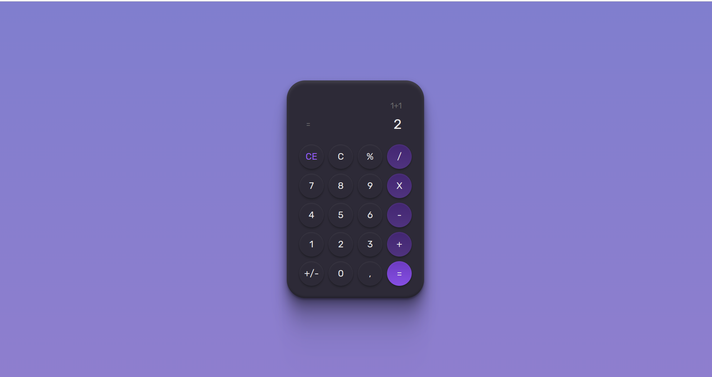

<h1 align="center"> Calculator </h1>

  Projeto para afiar o meu CSS.

  <a href="#tecnologies">Tecnologias</a>&nbsp;&nbsp;&nbsp;|&nbsp;&nbsp;&nbsp;
  <a href="#project">Projeto</a>&nbsp;&nbsp;&nbsp;|&nbsp;&nbsp;&nbsp;
    <a href="#orientações">Orientações</a>&nbsp;&nbsp;&nbsp;|&nbsp;&nbsp;&nbsp;
  <a href="#desafios">Desafios</a>&nbsp;&nbsp;&nbsp;|&nbsp;&nbsp;&nbsp;
  <a href="#extres">Extras</a>&nbsp;&nbsp;&nbsp;|&nbsp;&nbsp;&nbsp;
  <a href="#memo-licença">Licença</a>

  

 

  

## 🚀 Tecnologias

 Esse projeto foi desenvolvido com as seguintes tecnologias: 

- HTML e CSS;
- [Vite](https://vitejs.dev/);
- NPM.

## 💻 Projeto

 O "Calculator" é basicamente um desafio do Bora Codar da Rocketseat que representa uma calculadora.

## 🗺️ Orientações

 Você precisa ter apenas o NPM instalado em sua máquina para instalar as dependências necessárias.

<ul style="margin-left: 20px" id="orientations">
  <li> Execute em seu terminal o comando "npm install".</li>
  <li> Execute o comando "npm run dev" para rodar o projeto e depois acesse a rota especificada em seu terminal.</li>
</ul>

## ⚔️ Desafios enfrentados

  Não tive tantos desafios, exceto em relação a responsividade, no qual precisei trabalhar um pouco mais para deixar o mais responsivo possível para dispositivos com tela menores.

## 🧑‍🔧 Extras

 
  Algumas Melhorias que podem ser feitas por eu ou até mesmo por você caso queira no futuro:

  <ul style="margin-left: 20px">
      <li> Implementar JavaScript para realizar as funcionalidades básicas de uma calculadora.</li>
      <li> Implementar SASS. </li>
  </ul>

## Licença

Esse projeto está sob a licença MIT.